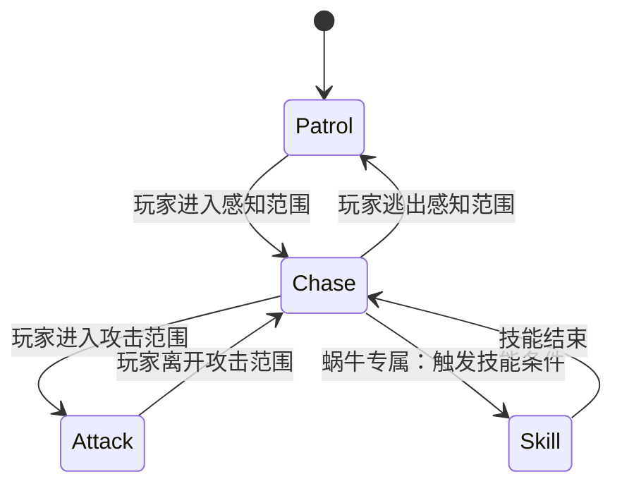

# ⚔️ 勇士传说 | 2D 横版冒险 RPG Demo

一个基于 Unity 开发的 2D 横版动作冒险游戏 Demo，参考 M_Studio 课程框架并在此基础上独立扩展完善。玩家扮演勇士在横版关卡中移动、跳跃、攻击，与具备 AI 行为的敌人战斗，体验流畅的动作手感与完整的玩法循环。

---

## 📸 游戏截图


---

## ✨ 功能特性

- **角色控制**：基于 New Input System 封装玩家控制器，实现精准的移动、跳跃与攻击手感，支持多设备输入
- **怪物 AI**：运用有限状态机（FSM）实现敌方 AI 巡逻 / 追击 / 攻击行为，降低代码耦合度，便于后续扩充怪物类型
- **平台判定**：结合 Physics2D 射线检测（Raycast）与层级碰撞矩阵，处理平台边缘判定与受击反馈
- **资源管理**：接入 Addressables 模块，实现游戏资产的异步按需加载，优化内存占用
- **事件系统**：使用 ScriptableObject 构建轻量级 Game Events 事件监听系统，实现 UI、音效与核心逻辑的完全解耦，有效解决跨物体引用混乱问题
- **UI 系统**：使用 UGUI + TextMeshPro 构建游戏界面，支持血量显示、攻击反馈等基础 HUD
- **调试辅助**：使用 Gizmos 可视化敌人巡逻范围、攻击半径与射线检测区域，便于开发调试

---

## 🛠 技术栈

| 类别 | 技术 |
| --- | --- |
| 引擎 | Unity 2022.x（URP） |
| 编程语言 | C# |
| UI | UGUI + TextMeshPro |
| 输入 | Unity New Input System |
| 资源管理 | Addressables（异步加载） |
| 数据架构 | ScriptableObject（Game Events 事件系统） |
| AI 架构 | 有限状态机（FSM） |
| 物理 | Physics2D Raycast + 层级碰撞矩阵 |
| 版本管理 | Git / GitHub |

---

## 📁 项目结构

```
Assets/
└── Scripts/
    ├── Enemy/                          # 敌方 AI 基类与状态机
    │   ├── BaseState.cs                # 状态基类
    │   ├── Enemy.cs                    # 敌人基类（属性、受击、死亡）
    │   ├── Bee/                        # 蜜蜂敌人
    │   │   ├── Bee.cs
    │   │   ├── BeeChaseState.cs
    │   │   └── BeePatrolState.cs
    │   ├── Boar/                       # 野猪敌人
    │   │   ├── Boar.cs
    │   │   ├── BoarChaseState.cs
    │   │   └── BoarPatrolState.cs
    │   └── Snail/                      # 蜗牛敌人（含技能状态）
    │       ├── Snail.cs
    │       ├── SnailChaseState.cs
    │       ├── SnailPatrolState.cs
    │       └── SnailSkillState.cs
    │
    ├── General/                        # 通用组件（角色/攻击共用）
    │   ├── Attack.cs                   # 攻击判定
    │   ├── AttackFinish.cs             # 攻击收尾处理
    │   ├── Character.cs                # 角色属性基类
    │   └── PhysicsCheck.cs             # Physics2D Raycast 平台边缘检测
    │
    ├── Player/                         # 玩家逻辑
    │   ├── PlayerController.cs         # 移动、跳跃、攻击、滑铲输入处理
    │   ├── PlayerAnimation.cs          # 动画状态驱动
    │   └── HurtAnimation.cs            # 受击动画反馈
    │
    ├── ScriptableObjects/              # SO 数据资产
    │   └── CharacterEventSO.cs         # 角色事件定义（ScriptableObject 事件系统）
    │
    ├── UI/                             # UI 控制脚本
    │   ├── PlayerStateBar.cs           # 血量 / 状态条
    │   └── UIManager.cs                # UI 全局管理
    │
    └── Utilities/                      # 工具类
        ├── Enums.cs                    # 全局枚举定义
        └── VirtualCamera.cs            # 摄像机跟随控制
```

---

## 🏗 核心架构

### 敌方 AI 状态机

所有敌人共享 `BaseState` 基类，按类型扩展各自的状态。蜗牛（Snail）在追击阶段额外拥有技能状态：



### ScriptableObject 事件系统

```
GameEvent (SO)
    ← GameEventListener 在 Inspector 中挂载响应方法
    ← 逻辑脚本（PlayerStats / EnemyAI）在运行时 Raise()
→ UI 更新 / 音效播放 完全解耦，无需直接引用
```

---

## 🎯 设计模式与工程实践

- **有限状态机（FSM）**：敌方 AI 通过状态基类 + 子状态实现巡逻 / 追击 / 攻击的清晰切换，新增敌人类型只需继承并重写状态逻辑
- **观察者模式（Game Events）**：基于 ScriptableObject 的事件系统替代直接引用，UI、音效对逻辑层零依赖
- **数据驱动（ScriptableObject）**：角色数值（移动速度、攻击力、血量）通过 SO 资产配置，无需改动代码即可调整数值平衡
- **物理分层（Layer Collision Matrix）**：合理配置碰撞层，避免角色与背景装饰物、敌人与敌人之间的无效碰撞，提升性能与判定精度
- **异步加载（Addressables）**：游戏资产按需加载，避免场景初始化时的卡顿，优化内存占用

---

## 🎮 操作说明

| 操作 | 键盘 |
| --- | --- |
| 移动 | A / D 或 ←→ |
| 跳跃 | Space |
| 攻击 | J |
| 互动 | E |

---

## 🚀 如何运行

1. 安装 Unity Hub 及对应版本的 Unity 编辑器（具体版本见 `ProjectSettings/ProjectVersion.txt`，当前为 Unity 2022.x）

2. 克隆本仓库

   ```bash
   git clone https://github.com/di-mao/2DAdventure.git
   ```

3. 使用 Unity Hub 打开项目根目录

4. 打开 `Assets/Scenes` 下的主场景，点击 Play 即可运行

---

## 📚 致谢与参考

- 项目框架来自 [M_Studio](https://space.bilibili.com/370283072)（Unity 中文课堂）的课程教学
- 在课程基础上独立完成了 ScriptableObject 事件系统、Addressables 资源管理、Shader 自定义特效以及调试可视化等功能的设计与实现

---

## 📝 License

本项目仅用于个人学习与作品展示，美术资源版权归原作者所有。
