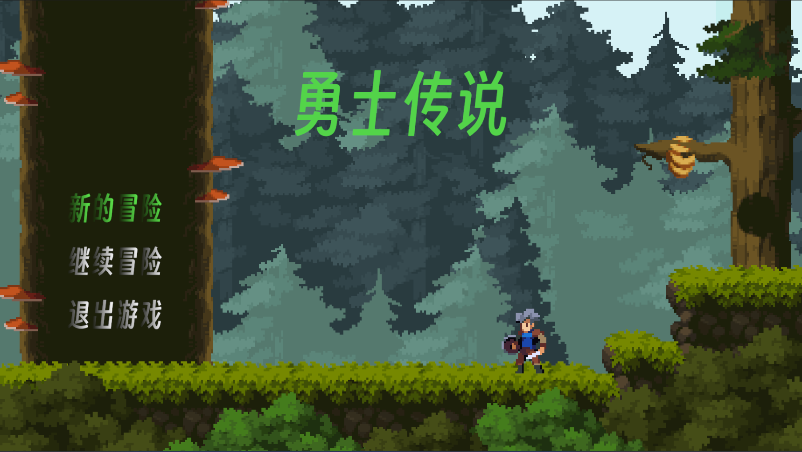
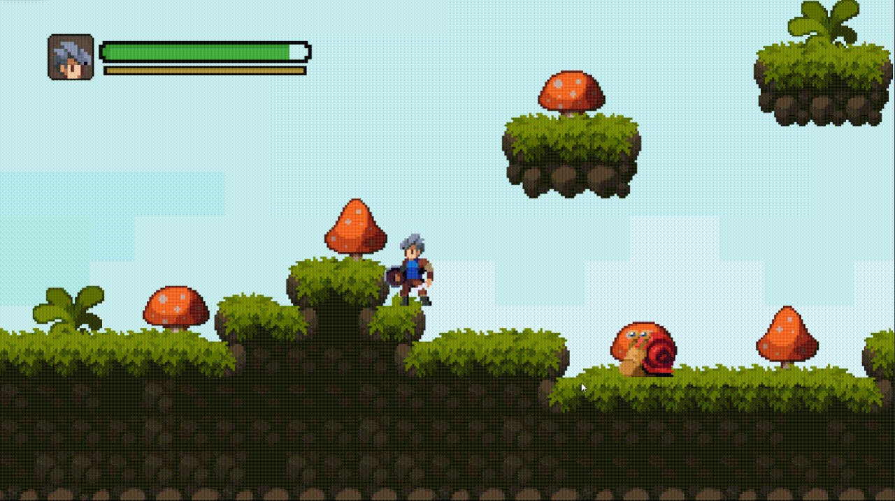

# 2D横版冒险RPG Demo

 <!-- 假设你有图 -->

## 项目简介
**跟随Unity中文课堂M_Studio老师的课程制作**

2D 横版动作冒险游戏 Demo

## 核心功能
- 使用 **New Input System** 实现角色移动、跳跃、攻击。
- 使用 **FSM** 实现怪物行为（巡逻/追击/攻击）。
- 使用 **Physics2D Raycast** 处理平台边缘判定与受击反馈。
- 使用 **Addressables** 实现资源异步加载，优化内存占用。
- 使用 **UGUI + TextMeshPro** 构建 UI 系统。

## 技术栈
- Unity 2022.x
- C#
- New Input System
- FSM (有限状态机)
- Addressables
- UGUI / TextMeshPro